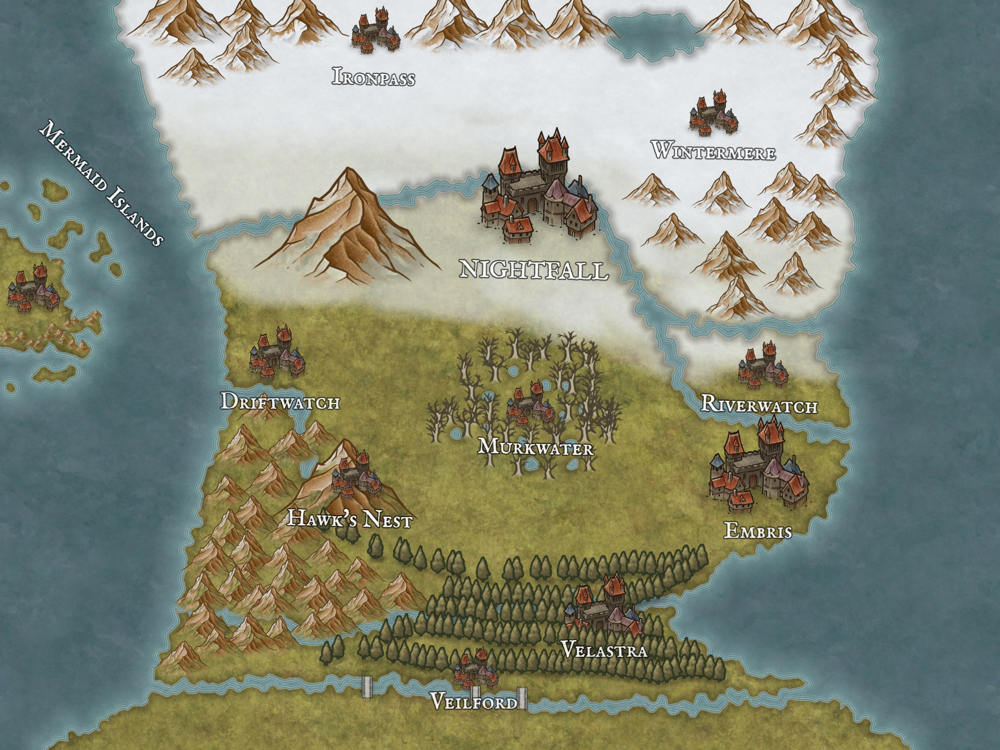

# World of Divine Fantasy: Whispers

## 1. World Structure

The world is structured in a clear hierarchy:

**Realms:** The largest macro-level divisions (e.g., "Realm of Men," "Realm of Elves").

**Regions:** Large territories within a Realm, each with a distinct identity.

**Areas (Locations):** These are the individual screens the player visits.

**Starting Realm:** Realm of Men
**Starting Region:** The Whispers
**Starting Area:** Driftwatch (Seat of House Carronvale)

---

## 2. Lore & World-Building of The Whispers

### 2.1. History & Overview
The Whispers is a land of stark contrasts, where snow-capped mountains give way to misty swamps and rocky coastlines. Named for the peculiar phenomenon where the winds seem to carry whispered voices through the valleys and peaks, this region has been the subject of myths and legends for generations. The capital city of Nightfall stands as a testament to the resilience of its people, with towering spires that pierce the often cloudy skies. House Seryn has ruled from Nightfall since 500-200 BW (Before the Great War), establishing a dynasty known for its strategic brilliance and unwavering resolve.

### 2.2. Geography
The Whispers features diverse terrain including the snow-capped mountains of Ironpass and Hawk's Nest, the frozen swamps of Murkwater, and the misty coastlines along the Mermaid Islands and Veilford.

### 2.3. People & Culture
The inhabitants of The Whispers are known for their resilience and adaptability. They have developed unique customs to survive the harsh environment, including elaborate winter festivals and specialized hunting techniques. Storytelling is central to the culture of The Whispers, with tales often focusing on the mysterious voices carried by the wind. Music, particularly haunting wind instruments, plays an important role in local traditions.

### 2.4. Noble Houses
The Whispers is home to several noble houses, each with their own history, traditions, and territories. House Seryn stands as the ruling family, with the other houses serving as their vassals.

**Ruling House: House Seryn**
- **Seat:** Nightfall
- **Description:** Rulers of The Whispers. Known for their discipline, honor, and martial prowess.
- **Sigil:** A silver moon on a purple field
- **Motto:** "You shall not take pleasure in death"
- **Ancestral Weapon:** Moonlight

**Vassal Houses:**
- **House Draymor:** Seat: Wintermere. Stoic and battle-hardened, stationed in the frigid mountains.
- **House Dunhart:** Seat: Ironpass. Powerful and steadfast in the northern reaches.
- **House Strigora:** Seat: Velastra. Ancient and enigmatic, bound to the Blackwood Forest.
- **House Valtara:** Seat: Hawk's Nest. Guardians of the southwestern reaches, known for keen eyes.
- **House Olaris:** Seat: Embris. Known for wealth, charm, and political savvy; master diplomats.
- **House Lirs:** Seat: Mermaid Islands. A uniquely matriarchal house, commanding the seas.
- **House Carronvale:** Seat: Driftwatch. Proud and steadfast, masters of sea and sword.
- **House Rellmont:** Seat: Riverwatch. Guardians of the vital river routes.
- **House Veynor:** Seat: Veilford. Southern gatekeepers of the Blackwood Forest.

**Destroyed Houses:**
- **House Odran:** Extinct. Led a rebellion in 730 AW, crushed by King Arthur Seryn.
- **House Cramb:** Wiped out during Odran's Rebellion (730 AW) as allies of Odran.

### 2.5. Key Locations & Institutions
- **Driftwatch Noble Quarter:** A clean, orderly district characterized by elegant stone architecture and well-maintained streets. It is home to the city's elite and serves as the headquarters for the city guard, stationed in Mosswatch Keep.
- **Leo's Lighthouse (Driftwatch Orphanage):** Located in Driftwatch, this institution is named after its heroic founder, Leo. It provides a safe haven for children who have lost their parents to the sea, illness, or misfortune.
- **The Grand Library:** Previously a small collection on the main street, the library has been moved to a new, more spacious building in the Noble Quarter. Maintained by its elderly and dedicated librarian, Adalia, it offers a growing collection of books. The "Read Books" action is available here.

---

## 3. Appendix: Major Historical Events

### 3.1. The Year of the Frozen Moon (30 AW)
The Year of the Frozen Moon (30 AW) was a period of unprecedented hardship in The Whispers when an unnatural winter descended upon the region, testing the resilience of its people and giving rise to the legend of the "Sons and Daughters of the Moon." This event would forever change the spiritual landscape of The Whispers and cement the Moon's Creed as the dominant faith in the region.

Amidst the bitter frost and growing hopelessness, a priest named Elias emerged as a beacon of light in Nightfall's darkest hour. A devout follower of the Moon's Creed, Elias traveled tirelessly through the frozen streets, tending to the sick, distributing what little food remained, and offering words of comfort. Miraculously, he uncovered hidden stores of food, seemingly appeared where aid was most needed, and brought warmth to the hearts of the suffering. His unwavering faith and compassion inspired the people to endure. Rumors spread that Elias was no mere man, but a "Son of the Moon," a prophesied figure sent to guide Nightfall through its most desperate times.

When the ice finally thawed and warmth returned to The Whispers, Nightfall emerged battered but not broken. The tales of Elias's miracles and selflessness spread far and wide, solidifying the belief in the "Sons and Daughters of the Moon."

**Other Children of the Moon:**
- **Vespera, the Port's Light (411 AW):** In 411 AW, the port city of Embris was ravaged by a deadly plague. Vespera, an alchemist, tirelessly worked to find a cure. Drawing upon her knowledge of rare herbs and alchemical processes, she synthesized a potent antidote and distributed it, saving countless lives and solidifying her place as a "Daughter of the Moon."
- **Leo, the Lighthouse's Flame (569 AW):** The original caretaker of the Driftwatch Orphanage. During a devastating wildfire, Leo refused to abandon the children under his care. He braved the inferno, guiding seven children to safety, sacrificing his own life when the burning roof collapsed upon him. He was honored as a "Son of the Moon," and the orphanage was rebuilt and renamed "Leo's Lighthouse" in his honor.

### 3.2. The Pearl War (367 AW)
The Pearl War (367 AW) was a defining conflict in the history of the Pearl Islands—now known as the Mermaid Islands—that reshaped the very foundation of House Lirs and established a matriarchal rule that would influence the region's culture for centuries. Sparked by the untimely death of Lord Isandro Lirs, the patriarch of the house, the war saw a brutal struggle for power between his two children: Lady Barbara Lirs, a seasoned naval commander, and her younger brother, Lord Craster Lirs, a politically favored but inexperienced leader.

At its core, the Pearl War was a conflict of identity, tradition, and ambition. The islands, named for their abundant pearl trade, had long balanced commerce and seafaring warfare. However, the death of Isandro, a respected yet aging leader, exposed a growing fracture in the islands' society—between those who sought to maintain the patriarchal customs of old and those who believed in the rising influence of women in warfare and leadership. The war for the Throne of Pearls had ended, but the repercussions of the conflict would echo through the Pearl Islands for generations. Barbara's victory not only marked the rise of House Lirs as a matriarchal power but also reshaped the cultural and political landscape of the islands, inspiring other coastal powers to embrace women as warriors, captains, and leaders.

### 3.3. The Great Maw Hunt (684 AW)
The Great Maw Hunt of 684 AW was a doomed expedition into the depths of the Murkwater Swamps led by Gregor Valtara, sixth son of Lord Brandon Valtara. Seeking glory and a legacy of his own, Gregor assembled a team of nine elite falconers from House Valtara to hunt the legendary beast known as the Great Maw—a creature that had become the subject of terrifying tales throughout The Whispers.

The expedition ended in tragedy, with only one survivor returning, his mind shattered by what he had witnessed. The fate of Gregor and his men remains one of the most chilling mysteries of The Whispers, and the failed hunt has since become a cautionary tale about the dangers that lurk in the Murkwater Swamps.

### 3.4. Odran's Rebellion (730 AW)
Odran's Rebellion (730 AW) was a significant armed conflict in The Whispers region, where several southern noble houses led by House Odran attempted to secede from the rule of House Seryn. The rebellion was ultimately crushed by King Arthur Seryn, known as the "Sword of Tomorrow," resulting in the complete extinction of Houses Odran and Cramb.

The conflict marked a pivotal moment in the history of The Whispers, reshaping the political landscape and demonstrating the military might and strategic brilliance of House Seryn. The rebellion unfolded in three major phases: the downfall of House Cramb, the twin offensive (comprising the Strigora Campaign and the Siege of Nightfall), and the final confrontation at Embris.

### 3.5. The Blood Auction Massacre (758 AW)
The Blood Auction Massacre (758 AW) stands as one of the most mysterious and disturbing events in the recent history of The Whispers. What began as a clandestine gathering of the Shadow Syndicate—a powerful criminal organization—ended in bloodshed and chaos, sending ripples through both the underworld and noble society alike.

The massacre occurred in secret chambers beneath the rebuilt city of Embris, where the Shadow Syndicate had organized one of their most exclusive underground markets—the Blood Auction. By dawn, over thirty attendees lay dead, including Martin Olaris, a prominent noble from House Olaris, and most of the valuable items had vanished along with the mysterious attackers. The event exposed the deep connections between the criminal underworld and noble society, while also revealing that even the most secretive and powerful organizations in The Whispers were vulnerable.
